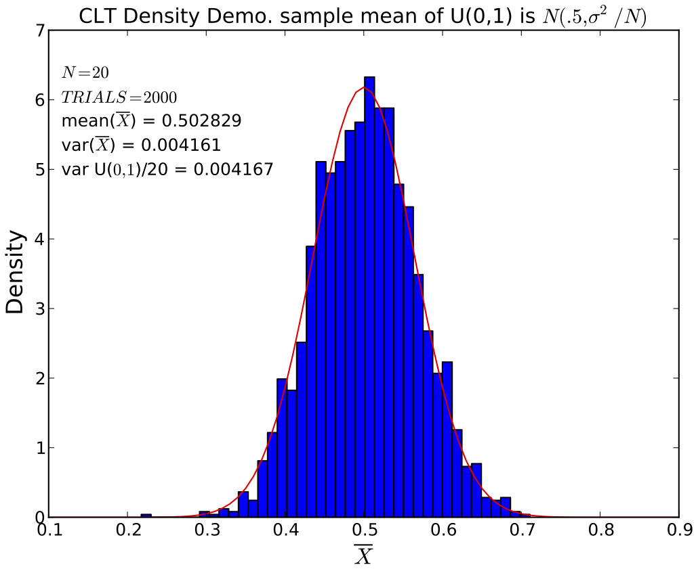
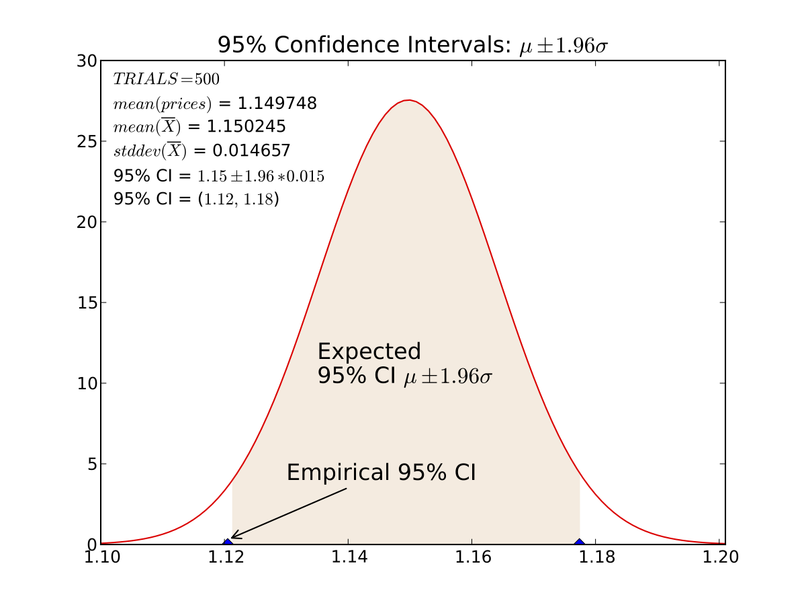
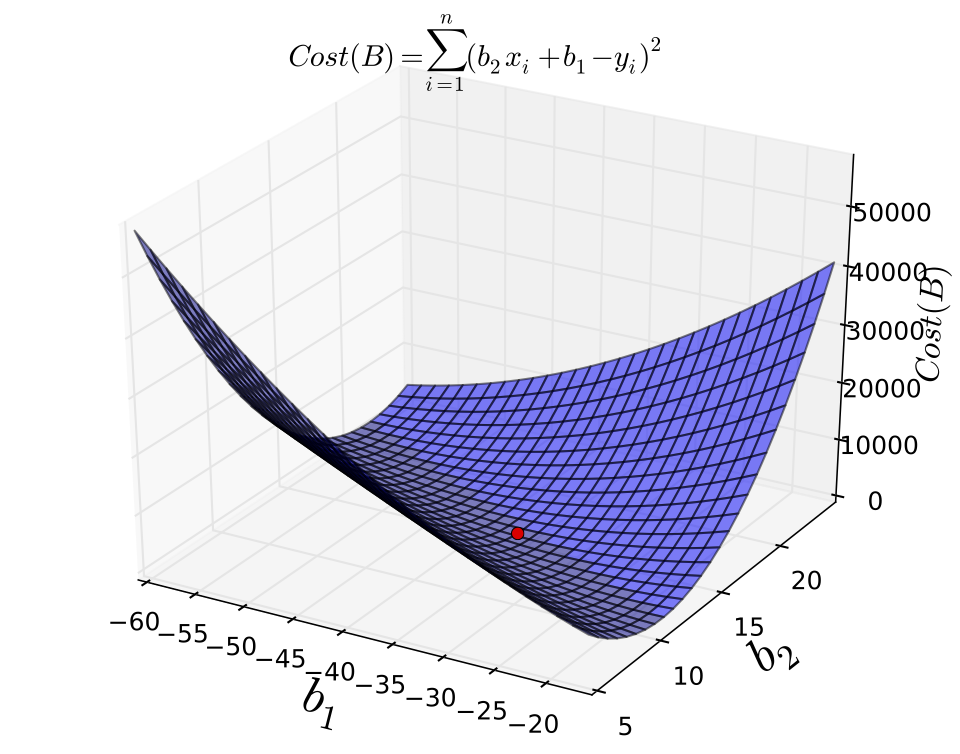
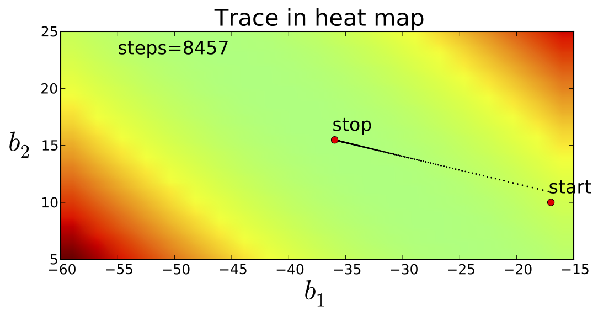

MSAN501 --Computational analytics
=======

The content contained in this repository represents a [set of exercises for the computational analytics](https://github.com/parrt/msan501/tree/master/labs) ([PDF](https://github.com/parrt/msan501/blob/master/labs/labs.pdf?raw=true)) 5-week bootcamp for the [MS in Analytics program at the University of San Francisco](http://analytics.usfca.edu). It collects all of the labs students must complete by the end of the bootcamp in order to pass. The labs start out as very simple tasks or step-by-step recipes but then accelerates in difficulty, culminating with an interesting text analysis project.

# Table of contents
## Part I -- Introduction

* Audience and Summary
* ``Newbies say the darndest things''

## Part II -- Python Programming and Data Structures

* Computing Point Statistics
* Approximating sqrt(n) with the Babylonian Method
* Generating Uniform Random Numbers
* Histograms Using matplotlib
* Graph Adjacency Lists and Matrices
* Launching a Virtual Machine at Amazon Web Services

## Part III -- Empirical statistics

* Generating Binomial Distributions
* Generating Exponential Random Variables
* The Central Limit Theorem in Action
* Generating Normal Random Variables
* Confidence Intervals for Price of Hostess Twinkies
* Is Free Beer Good For Tips?

## Part IV -- Optimization and Prediction

* Iterative Optimization Via Gradient Descent
* Predicting Murder Rates With Gradient Descent

## Part V -- Text Analysis

* Summarizing Reuters Articles with TFIDF

# Summary

This course is specifically designed as an introduction to analytics programming for those who are not yet skilled programmers. The course also explores many concepts from math and statistics, but in an empirical fashion rather than symbolically as one would do in a math class. Consequently, this course is also useful to programmers who would like to strengthen their understanding of numerical methods.

The exercises are grouped into four parts. We begin with simple programs to compute statistics, build simple data structures, and use libraries to create visualizations. The empirical statistics part strives to give an intuitive feel for random variables, density functions, the central limit theorem, hypothesis testing, and confidence intervals. It's one thing to learn about their formal definitions, but to get a really solid grasp of these concepts, it really helps to observe statistics in action. All of the techniques we'll use in empirical statistics rely on the ability to generate random values from a particular distribution. We can do it all from a uniform random number generator, which is the first exercise in that part.

 

The optimization exercises deal with minimizing functions. Given a particular function, f(x), optimizing it generally means finding its minimum or maximum, which occur when the derivative goes flat: f'(x) = 0. When the function's derivative cannot be derived symbolically, we're left with a general technique called *gradient descent* that searches for minima. It's like putting a marble on a hilly surface and letting gravity bring it to the nearest minimum.

 

Finally, we'll do an exercise that introduces text analysis. We'll compute something called *TFIDF* that indicates how well that word distinguishes a document from other documents in a corpus.  That score is used broadly in text analytics, but our exercise uses it to summarize documents by listing the most important words.
