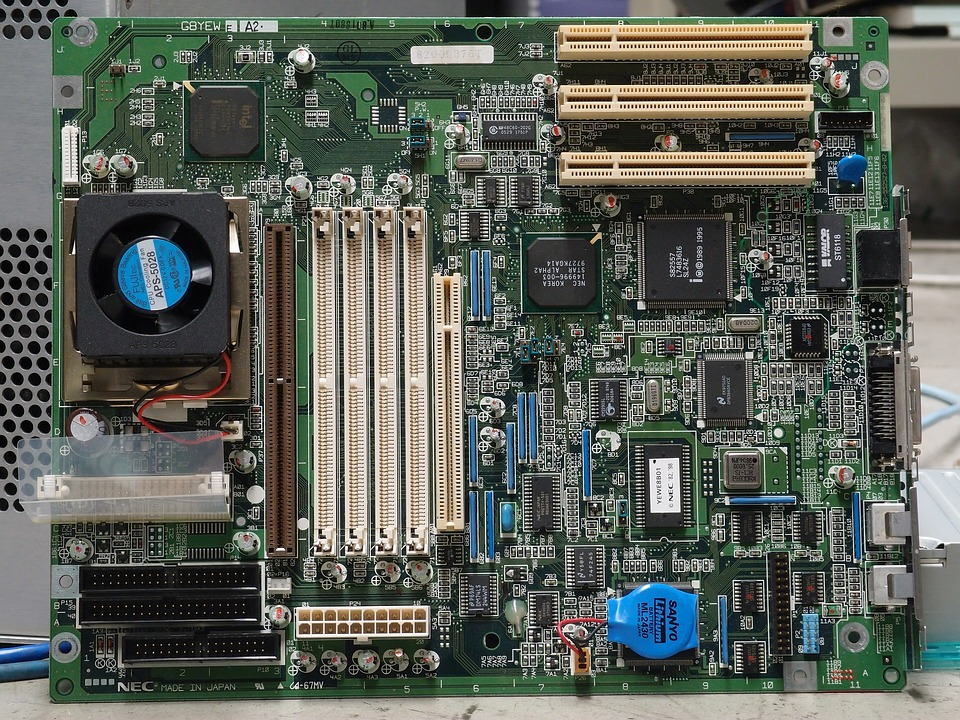
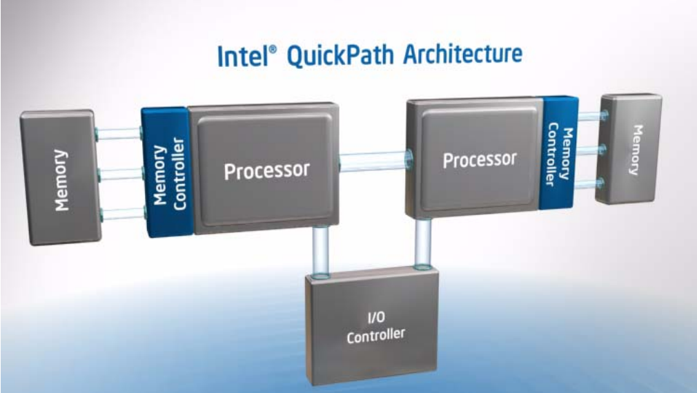
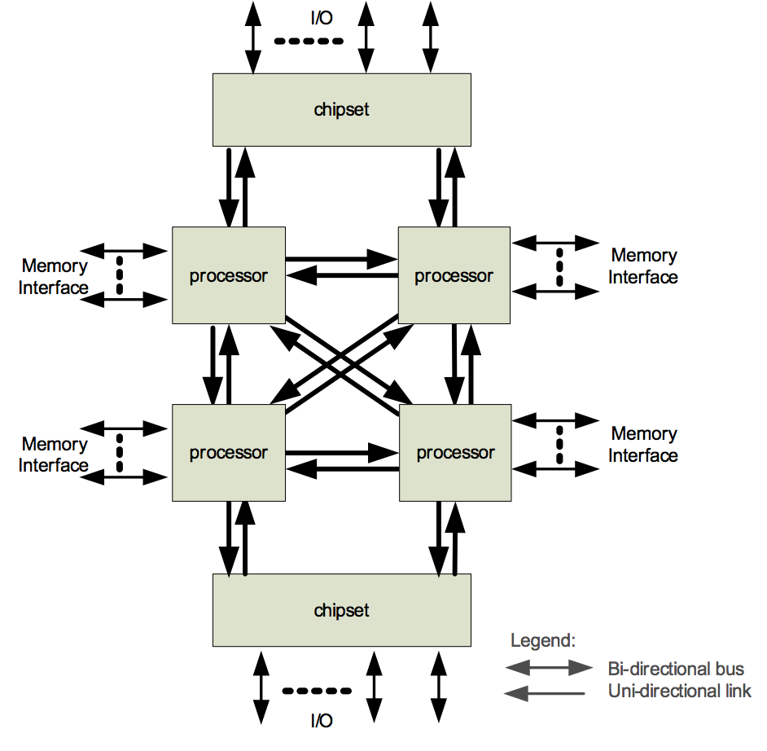

# Overview of computer architecture

Why: architecture affects speed of your program, primarily memory hierarchy. (Algorithm is biggest but not arch issue) how big of a data set can you process? How fast can you transfer data beween machines? You should know the terminology used in the computing field, even if it's just for passing interviews.

Quiz: What do the following terms mean:

* cache
* core
* GPU
* bandwidth
* clock rate
* Moore's law
* RAM
* ROM
* bus

get motherboard image, such as [motherboard](https://pixabay.com/en/technology-computer-motherboard-1396677/)



Conceptual integrity or theme: everything is a network of computing, storage, input device, display device. At all layers we will see the same fractal pattern.

Draw CPU, RAM, USB bus with mouse/keyboard, disk, bus interconnect.


## Memory

RAM [image](https://pixabay.com/en/computer-memory-chips-technology-857098/) (note 8 chips on package) holds both the program and any data needed by the program. The memory also holds the operating system which manages the execution of processes and the physical devices.  RAM is a set of addressable pigeonholes from 0..N for N=maybe 8G in your laptop, which is 8,000M or 8,000,000k or 8,000,000,000 bytes or 8 billion bytes. That the lot. The San Francisco phonebook is maybe 10 MB.

Random-access vs tape storage, which is serial.

RAM is typically much smaller than the disk storage size.

DRAM is volatile: memory disappears when you turn the computer off. this is the biggest chunk of RAM you have.

ROM: firmware, which holds basic code to boot up the computer and manage the lowest level connection to devices.

Static RAM "flash memory": SD cards. e.g., phone pic/data storage.  nonvolatile.

Bit vs byte. bit (BInary digiT) is the smallest unit of information in a computer. yes/no, 0/1. M/F.

You should get familiar with k, M, G for memory size requirements to know how much your program requires for operation or how big a disk file will be.

## CPU

CPU execs very simple instructions (arith, compare, jump, ...) but very quickly

mov r0, 5		; r0 = 5
mov r1, 10	; r1 = 10
add r2, r0, r1; r2 = r0 + r1

CPUs execute instructions to the heartbeat of a clock, which is where we get the term clock rate. For example, a 1Ghz clock such as you might have on your phone, gives 1 billion tics per second. That means each instruction takes 1 billionth of a second or 1 nanosecond. It goes milli, micro, nano, femto

Many instructions can operate in just one clock cycle, but some take several... particularly if it has to go to RAM.

Draw another processor on bus using [Intel quick path](http://www.intel.com/content/www/us/en/io/quickpath-technology/quick-path-interconnect-introduction-paper.html)





Draw GPU on bus

Now add core

### Cache


 
ARM assembly to load byte data at address 100 into register.

```
MOV r3, 100		; 1 ns
LDR r4, [r3]		; 80-120ns
```

Draw L2, L3 caches between processor and bus.

* L1 cache might have a 1ns access latency. size 64kcode/16k data
* L2 10ns latency. 2MB
* L3 ~85ns latency 8M

The processor runs many many times faster than the memory so we created faster but smaller RAM that can hold frequently accessed data closer to the processor. There can be three levels of cache and then within the processor there is the register set which is superfast but very limited in size.

There is a memory hierarchy the get slower and slower as you go outwards. We can even view the RAM on other machines as part of our network

## Networks

Draw network card with network connection

Network transfer speeds. You are limited to say 10Mbps on USF connections but I have 100 Mb per second at home. the University has a number of 1G channels. how long does it take to transfer a 1G file?

the physical layer is called ethernet but there are lots of different kinds of networks. Ethernet is 10-1000M bits / sec

Wireless is another physical layer that uses radio waves to transmit information. This is like the electrical connection/wires used by ethernet.

## OS

Controls the resources and devices of the computer.

Threads versus processes.