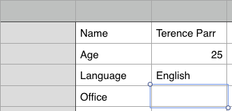

# Raw Notes on Python


```
$ python
Python 2.7.11 (default, Jun  7 2016, 10:09:37) 
[GCC 4.2.1 Compatible Apple LLVM 7.3.0 (clang-703.0.31)] on darwin
Type "help", "copyright", "credits" or "license" for more information.
>>> print "hello msan501!"
hello msan501!
>>> 
$ 
```

## Scripts vs interacive

Using a file instead of interactive. Edit a file and put some simple commands in there and then run from the command line.

```
$ cat > /tmp/t.py
# My first script!
print "1+2 is", 1+2
~/courses/CS110/lectures $ python /tmp/t.py
1+2 is 3
```

Also then load the PyCharm development environment and do it.

Note that interactive sessions print out the value like a calculator if you just given expression they do nothing if it’s in the script, which is why multi-line strings act as comments inside of scripts.

```
>>> print "My name is:", # no newline My name is:
My name is:
>>> print "parrt"
parrt
```

## Expressions

```
+-*/
```

Order of operations matter for expressions for operators of different precedence. 1+2*3. using parentheses to overcome precedence.

Remember that the operator is sensitive to the operand type

```
3*4
"hi"*4
4*"hi"
4-"hi" # ill-defined
"hi"+"mom"
```

we can add strings

define operand and operator

talk about type promotionto the most complicated type from integer to float.

Remind them about int("1234") and float("1.23") Then show how to use %5.2f.

show the conversion of some math formulas into programming

4xy, 2^3. x over 2. 3x^9

EX. Calculate the area of the square or rectangle

show them how to use the % string operator and remind them that it is not the numeric modulo operator.

```
"%s, %s" % ("parr", "ter")
```

not: 11 % 3

"The [adjective] [noun] was very hungry, so it decided to [verb] to the nearest restaurant."

## Variables and assignment

Programs that do not interact with the user are pretty boring and effectively useless unless you are using them as a calculator to figure out, for example a 15% tip on your restaurant bill. 0.15 * 43.82$. Programs ask you to enter your username or imagine a program that converts between Celsius and Fahrenheit. You would type in a value to be converted.

It’s just like using a spreadsheet:



Variables are used to store what you type in but for now let’s play around with hardcoded values that we type then directly into the script or program. The format is
`name = value`:

```
>>> x = 1
>>> y = 2.3
>>> z = "parrt"
>>> x = 99 # we can reassign things too
```

Ex: write the equivalent Python for the first three rows in spreadsheet. It should be 3 lines long. This does not work: *value* = *name*

```
>>> 25 = age
File "<stdin>", line 1
SyntaxError: can’t assign to literal
To figure out what’s stored in variable, use print or if using the interactive shell, just use the name.
>>> name = "parrt"
>>> name
’parrt’
>>> print name
parrt 
>>> print "Hi! My name is", name
Hi! My name is parrt
```

We can also use so-called multiple assignments

```
>>> name, age = "parrt", 25
>>> print name, age
parrt 25
>>> (name, age) = ("parrt", 25) # sometimes you will see it this way
```

You will also see multiple variable set to the same value sometimes:

```
>>> first = last = "Chen" 
```

**Valid symbols**. You can’t use one of the reserved key words like if, True, False, for, while, print, ...

```
>>> if = 3
File "<stdin>", line 1
if = 3 ^
SyntaxError: invalid syntax
```

You can’t use spaces in the name but you can use the _ like `first_name`. The first character must be a letter or the underscore character but you can follow up with letters, numbers, _. Upper and lower case are okay: `x` vs `X` are different variables.

### More assignment operators

```python
=, +=, -=, *= ...
i += 1 is very common
```

## Random numbers

```python
import random
num = random.randint(1,5) # [1..5] inclusive
print num
```

```python
import random
num = random.random()
print num
```

or

```python
from random import *
num = random() # this is function random.random()
print num
...
```

Print random letter:

```
print ord('a')
print random.randint(ord('a'),ord('z'))
print chr(random.randint(ord('a'),ord('z')))
```

Q. What is ord('b') - ord('a')?

## IF statements

the basic form is

```python
if Boolean expression:
    statements
```

Those statements are only executed if the expression is true when it is executed at runtime. Nothing happens if it evaluates to false.

```
if True:
    print "hi"
```

Talk about indentation and using tabs or spaces butalways choose one or the other.

The first unindented statement marks the end of the block or statement list.

EX. Print out if a value is positive

```
if x > 0:
    print "x is positive"
```

EX. Implement math.abs(x)

```python
if x<0: x = -x
```

or

```python
if x<0:
    x = -x
```

Q. How to generate H, T for coin toss? Print a guess from random [1,2] but as 'H', 'T'

```
flip = random.randint(1,2)
if flip==1: print 'H'
else: print 'T'
```

To execute something if the expression is false, just use the "not" in front

```
if not False:
    print "hi"
```

## ELSE

There is a slightly more complicated form that will execute something when the expression is false.

```
if x >= 0
    print x, "is positive"
else:
    print x, "is negative"
```

You might want to use a sequence of these.

```
if x < y:
    print x, "is less than", y
elif x > y:
    print x, "is greater than", y
else:
    print x, "and", y, "are equal"
```

things can be more complicated.

```
score = ... ask user to enter score ...
if score is between 90 and 100, grade = 'A'
else if score is between 80 and 90, grade = 'B'
else if score is between 70 and 80, grade = 'C'
else if score is between 60 and 70, grade = 'D'
else grade = 'F'
```

**Getting input from user**:

```python
yearly = raw_input("Your yearly salary: ")
```

EX. check to make sure that the type is digit (whole number, non-float).

```
yearly = raw_input("Your yearly salary: ")
if yearly.isdigit():
    print "yearly", int(yearly) # yearly is a string so convert
```

EX. Write a program that prints out the correct last name when a user types in the first name. Predefine the last names of three of your best friends. Hint: name == "Ter" will test string equality and you need to test name 3x. For example, I might want the following associations:

```
Input Output
===== ======
Ter Parr
Tom Burns
Dale Smith
```

### Relational ops

Works for strings and numbers.

```
< > <= >=
```

`"apple" < "book"`

`in` operator: `"ar" in "parr"` is `True`

###  Equality == !=

```
"hi" == "hi" True
```

Works for any object. Two different objects have the same "value" for whatever that means. You might have two book objects in a bookstore program that have the same data but are not physically the same object.

do not get confused between assignment and equals operator. "hi"=="hi" not "hi"="hi"

###  Identity

```
is
is not
```

```
>>> id("hi")
4306331048
>>> a = "h"
>>> b = "i"
>>> a+b
'hi'
>>> id(a+b)
4307056880
>>> id("hi")
4306331048
>>> print "hi"==a+b
True
>>> print "hi" is a+b # they are different objects
False
```

### AND/OR

We also have logical operators: and, or, not.

to determine when something is between 0 and 10. `x>0 and x<10` but python also has `0 < x < 10`.

`in110 and (istue or isthur)` then I know where you are

`csmajor or mathmajor` then you might get a programming job


## Nested IF

An IF statement is a statement like any other and so we can have a conditional within a conditional. Try to avoid making deeply nested conditionals as it is hard to follow. Proper indentation is even more critical here.

Nested IFs are like AND conditions

```
if in110:
    if istue or isthur:
        print "You have class"
```

that is the same as `in110 and (istue or isthur)`

```
if in110:
    if istue or isthur:
        print "You have class"
    else
        print "You do not have class"
```

EX. guessing game. First, print out "Think of an animal". Then ask "Can it fly?" Expect the user to type "yes" or "no". If the value they type then is "yes", then guess "It is bird". If they did not type "yes", ask "Does it have 2 legs?". If "yes",guess "It is a human" else guess "It is a cow".

# While loops

Process of going through a loop is “iteration”

If a loop cycles through 5 times, it has “iterated” 5 times

```
while True:
 print "chatty"
```

same thing:

```
hungry = True
while hungry:
 print "yum"
```

```
hungry = 1
while hungry:
 print "yum"
```

**PATTERN**:

```
initialization
while continuation_condition :
 do main action to be repeated
 prepare variables for the next time through the loop
```

**PATTERN**: Count to i to j

```
count = 1
while count <= 10:
   print count
   count = count + 1

```

Note: `x = x + 1` is assignment of x to x + 1 not equality.


```
count = 1
while count != 10:
   print count
   count += 2
```

EX: sum numbers from 1 to 100; check answer with sum = n(n+1) / 2 for n=100

**PATTERN**: accumulate

```
init accumulator variable, which is a counter or list or text buffer
while more work or more elements or more input:
    add, append, or otherwise operate on the accumulator
    increment counter or read more input
```

EX: get input lines until "." on line by itself

EX: print how many days until it's warmer than 90 (range 1-100) then print "go outside"; hint: pseudo-code:

```
get random number between 1 and 100
days count is 0
while it's <= 90
  increment days count
  get another random number
print "go outside after %d days" % days
```

Example: Fahrenheit into Celsius

```
f = float(raw_input("Enter temp in fahrenheit: "))
c = (f - 32.0) * 5.0/9.0
print c, "degrees celcius"
```

Then put while True around

EX: guess my random number 1 to 10; hint. recall:
num = raw_input("Enter a number  :")

```
get random number 1 to 10
forever loop:
  ask for guess
  if the random number, break out
print "You got it:", num
```

```
$ python code/guess-number.py
Enter guess: 1
Enter guess: 2
Enter guess: 3
Enter guess: 4
Enter guess: 5
Enter guess: 6
Enter guess: 7
Enter guess: 8
You got it: 8
```

TABLES

See table.py

Times table. How to get all n x m possible multiplications?

```
Times table
 n m n*m
== == ====
 0 0 0
 0 1 0
 0 2 0
 0 3 0
 0 4 0
 0 4 0
 1 0 0
 1 1 1
 1 2 2
 1 3 3
 1 4 4
 1 4 4
 2 0 0
 2 1 2
...
```

```
print "Times table"
print "%2s  %2s  %4s" % ("n", "m", "n*m")
print "%2s  %2s  %4s" % ("="*2, "="*2, "="*4)
n = 0
m = 0
while n<=5:
 print "%2d  %2d  %4d" % (n,m,n*m)
 n += 1
 m += 1 # <-- not enough
```

Can then try:


```
print "Times table"
print "%2s  %2s  %4s" % ("n", "m", "n*m")
print "%2s  %2s  %4s" % ("="*2, "="*2, "="*4)
n = 0
while n<=5:
 m = 0
 print "%2d  %2d  %4d" % (n,m,n*m)
 m = 1
 print "%2d  %2d  %4d" % (n,m,n*m)
 m = 2
 print "%2d  %2d  %4d" % (n,m,n*m)
 m = 3
 print "%2d  %2d  %4d" % (n,m,n*m)
 m = 4
 print "%2d  %2d  %4d" % (n,m,n*m)
 m = 4
 print "%2d  %2d  %4d" % (n,m,n*m)

 n += 1
```

## Nested while loops

USE: combination of 2 or more sequences, lists, ...

What we want:

```
print "Times table"
print "%2s  %2s  %4s" % ("n", "m", "n*m")
print "%2s  %2s  %4s" % ("="*2, "="*2, "="*4)
n = 0
while n<=5:
 m = 0
 while m<=5:
  print "%2d  %2d  %4d" % (n,m,n*m)
  m += 1
 n += 1
```

See matrix.py. draws matrix all at once but slowly. Just show execution.

# FOR loops

while used less often than for. Another kind of loop that is a shorthand for the while loop. It automatically handles counter variable mechanism and is typically used to walk through a list of stuff.

Typical form:

```
FOR x in _____:
 process x
```

```
for i in [1,2,3,4,5]:# print "hi five times"
```

the loop variable, i, assumes each value in turn

for i in [1,2,3,4,5]:# print i

A shorthand for 1,2,3,... is

```
range(n) gives 0..n-1
range(n,m) gives n..m-1
range(n,m,s) gives n..m-1 stepping by s
range(10,0,-1) is [10, 9, 8, 7, 6, 5, 4, 3, 2, 1]
```

help("range")

The relationship between while loops and for loops


```
i = 0
while i<10:
 print i
 i += 1

for i in range(10):
 print i

for i in range(1,10,2):
 print i
```

Back to lists. We will talk about these later but assume that lists can contain more than just numbers. They are like books with lots of pages and on each page you can have different stuff.

```
for name in ['parrt', 'tombu', 'kg9s']:
 print "Name:", name
```

# Functions

Functions are an alias for a group of statements.

We do not group them randomly. A function should perform a specific task and be identified by good name like max, sine, len, range, etc...

We been using functions for quite a while but have not really to find any and that's what we need to worry about now. first, let's review calling functions.

## unqualified func calls

```
 len(['a', 'b'])
 print("hi")
```

same as:

```
import __builtin__
 __builtin__.len([1,2])
```

## qualified func calls

```
import math
math.sin(3.14159)
```

method calls; messages to objects

```
'hi'.toupper()
```

so it is module.func(...) or object.method(...).  We will delay the latter until later in the semester in terms of definition but will continue to use them.

## Why?

break a complicated problem down into manageable pieces; divide and conquer.

it is a way to organize our code

the code tends to be much simpler when we can refer to higher-level elements rather than just Python statements and expressions. For example, we get to use turtle.forward(100) without worrying about how that actually works.

it is a way to provide reusable pieces; by ourselves and others if we make a library.

We must avoid cut-and-paste programming; DRY concept. you want a single location to change any single concept or value. That's also why we use a constant name instead of literal numbers everywhere.

it's easier to test our code if we can call functions with values and test the results. If something goes wrong, we know that the problem is likely in that function or something it calls.

functions make it easier for us to work together. For example, we can divide up the functions we need to write between multiple programmers. I can start things out and then later hook in the real stuff built by somebody else. For example, if someone is building a function called salary(employee), I can make a dummy function that simply returns 100. Later I can replace it with the real function provided by somebody else.

## How?

Must be named/created before we can use them.

Same naming rules apply as they did for variables:
* You can’t use any of Python’s keywords
* No spaces
* The first character must be A-Z or a-z or the “_” character
* After the first character you can use A-Z, a-z, “_” or 0-9
* Uppercase and lowercase characters are distinct

we normally define functions first at the top of the file and then use them. The basic structure goes like this

```
import modules
define your constants and global variables (or after the functions)
define your functions
use your functions
```

most basic function has no arguments and no return value

```
def myfunc(): # this defines it but does not executed. deferred execution
 <statement or statements>

myfunc() # this actually executes it. we "call" it
```

when it is done, we say that the function returns. It returns to the caller.


```
def hello():
   print ("Hello there!")
def goodbye():
   print ("See ya!")

hello() # after finishing, hello returns to the "location" after this call
hello() # 2nd call or "invocation"
goodbye()
```


```
def main():
   print ("I have a message for you.")
   message()
   print ("Goodbye!")

def message():
   print ("The password is 'foo'")

main()
```


Functions do more than just execute sequence of statements. They can return values.

```
def one():
 return 1
```

The return value can be as simple or complicated as we need. We must use the return statement to send a value back.

Make sure that you have a return statement on all execution paths.

```
def polarity():
 if x > 0:
  return "positive"
 elif x == 0:
  return "zero"
 else:
  return "negative"

x = int(raw_input("enter value: "))
print polarity()
```

We do not need the global specifier because we are not assigning to x in polarity(). To be safe, we should indicate that we are referencing a global variable:

```
def polarity():
 global x
 ...
```

Sometimes we need to compute stuff and so need temp vars. these are 

## LOCALS vs GLOBALS

globals assigned to outside of a function

locals assigned to inside of a function.

Not visible outside of that function.

a new one gets created each time you call the function

```
def food():
 items = "cookie, butter, salt".split(", ") # LOCAL
 print items

print items # cannot access local outside
```

But we can return it

```
def food():
 items = "cookie, butter, salt".split(", ") # LOCAL
 return items

print food()
```

a variable on left side of = defines a local in a function and global outside.


Most of the time functions are not useful unless we are passing parameters. In an optimal world, functions don't access ANY global variables and are therefore a function only of their parameters. In this way, we can prevent side effects like the following:

```
x = 10
def f():
 global x
 x += 1 # alters a global variable

f()
f() # every time we call f, it changes a global variable. bad
```

We are trying to reduce what we have to think about at any one moment.

Arguments or for passing data to a function. We have been doing this all the time with the built-in functions like

```
print random.randint(1,5)
```

and

```
print len("hi")
```

The only differences now we have to define functions that take these values

```
def name(arg1, arg2, ..., argN):
 statements

def one(): return 1
def negate(x): return -x
def add(x,y): return x+y
def pow(x,y): return x**y

print one()
print negate(3)
print negate(-3)
print add(3,5)
print add(5,3)
print pow(3,5)
print pow(5,3)
```

The position matters; i.e., x comes first and then y.

BEWARE: you can override a predefined function.

```
print len("hi")
2
>>> def len(x): return 0
...
>>> print len("hi")
0
```

also

```
def f(): print "hi"
def f(): print "bye" # 2nd ambig def overrides first one
f() # print "bye"
```


The parameters act like local variables that are initialized from the values passed at the function call site.

EX: Alter your box function so that it takes a parameter called width and use that in your forward calls instead of the literal number 100.

Unfortunately we cannot specify the required types of the parameters. We just give the name. On the other hand, we can manually check the type inside the function:

```
def negate(x):
 if isinstance(x, int):
  return -x
 return 0
```

EX: write a function called sum that returns the sum of the list argument. call the argument data. Assume that the incoming argument is a list of integers and that it will be called like this: sum([1,2,3]) or even sum(range(100))

EX: write a function called euro that converts parameter d to euros. Currently there are 0.77 euros per dollar.

print euro(2.0)

should return 1.54, which is 2 * 0.77

Calling a function and setting parameters is like any other variable assignment. For the simple elements li willke numbers

```
x = 2
y = x
y = 3
print x # still 2
```

But recall that strings and array references and other objects our pointed at by references and so variable assignment makes a copy of the reference.

```
x = ['parrt', 'tombu']
y = x
y[1] = 123
print x # ['parrt', 123]

def f(x):
 print x
 x = 3 # doesn't change outside world
 print x

y = 10
f(y)
print y # still 10. x not visible

def upper(data):
 print data
 for i in range(len(data)):
  data[i] = data[i].upper()
 print data

x = ['a', 'b', 'c']
upper(x)
print x


def speak(msg="Hi"):
 print msg

msg("hello")
msg()

def box(x,y,width=100):
 ...

box(30,40)
box(30,40,300)
```


with more than 1 arg, order is critical. can get it wrong. better to name them at call site

```
box(x=30, y=40, width=100)
```

can do just some:

```
box(30,40, width=100)
```

but positional must occur before named at call site.

Default arg has nothing to do with naming args at call site.


```
def speak(msg):
 print "speaking: "+msg

def sing(it):
 print "singing: "+it

def callme(f):
 f("hello")

callme(speak) # hello
callme(sing)
```

see sin-plot.py code

## GLOBALS

assignments outside func

Global variables can be accessed by any statement in your program file (but not other files), including by statements in any function (but put global x at start of func if you are assigning to global).

As a rule, don't write to globals in a func. bad to read them too unless a constant.

# Lists

We've been working with variables. Variables can only hold one piece of data at a time.

```
x = 3
y = "hi"
z = 4.0
```

And when we need more than one, we do things like name1, name2, etc... There is an easier way. We can make a list.

Lists are sequences of objects. These are also called arrays.

```
[1,2,3,4]
['parrt', 'tombu']
```

Lists can have homogeneous or heterogeneous items.

```
['parrt', 1.2, True]
```

Lists are like books whose pages we can individually access. We can also treat the book as a single object.

The multiplication symbol means repetition to arrays:

```
[1,2]*3
[1, 2, 1, 2, 1, 2]
```

## List concatenation

we can concatenate two lists using the addition symbol

```
[1,2] + [9,10,11]
[1, 2, 9, 10, 11]
```

## Indexing elements

Books are referenced by page number, list elements are referenced by their index number.

indexes start at 0 not 1.

```
>>> names = ['lois', 'stewie', 'peter', 'brian']
>>> names[0]
```

What happens when you using index out of range?

```
names[100]
Traceback (most recent call last):
  File "<stdin>", line 1, in <module>
IndexError: list index out of range
```

Changing the value of an item. things are mutable

```
names[0] = 'chris'
```

List variables point at the region in memory that holds the list so that multiple list variables can refer to the same list. doing an assignment from one to the other does not make a copy!!

```
names = ['lois', 'stewie', 'peter', 'brian']
actors = names # points at the same list
```

show this on Python tutor.

changing an element in one makes it change in another.

## copying a list

```
n = []+names
```

## Creating lists

```
[] empty
[0]*10 10 zeros
range(0,10,2)# even numbers
```

Now show that it is a different list.

iterating over a list

```
for name in names:
 print name
```

**Ex**: count the number of A's

```
grades = [90,100,70,45,76,84,93,21,36,99,100]
```


A for loop is a convenient way to sequentially iterate through a list.
* The target variable in a for loop assumes the value of the current item in
the list as you iterate.
* However, the target variable isn’t very helpful if you want to change the value of an item in a list since it is just a copy of the data that exists in the list.

So, we are back to using a counting pattern with a while loop or a for loop:

we need len()

```
for i in range(len(names)):
     print i, names[i]
```

or with a while loop

```
i = 0
while i<len(names):
 print names[i]
 i += 1
```

**Ex**: Given the following list of prices, write a program that
modifies the list to include 7% sales tax

```
prices = [1.99, 2.99, 3.99, 4.99, 5.99, 6.99]
```


```
'hi'.upper()
'Hi'.lower()
' foo '.strip()
x = 'a,b,c'.split(',')
import string
string.join(x,', ')
or the bizarre: ', '.join(x)
```


```
>>> l = []
>>> for c in s:
... l += c
...
>>> l
['a', 'b', 'c']
```

# Searching, mapping

Searching a list

```
def find(x, data):
 for d in data:
  if d==x:
   return True
 return False

print find('a', ['a',3,'b'])
```

**Ex**: Implement index(x, data) that returns the index (0..length-1) rather than just true or false.

## Inserting into a list

```
def insert(x, i, data):
 before = data[0:i]
 after = data[i:len(data)]
 bigger = before + [x] + after
 return bigger

print insert('p', 2, ['a','b','c','d'])
print insert('p', 0, ['a','b','c','d']) # first
print insert('p', 4, ['a','b','c','d']) # last
```

**Ex**: delete index from a list. delete(i,data).

Sum a list. (Review)

```
s = 0
for x in data:
 s += x
```

## Reverse a list

```
def reverse(data):
 n = len(data)
 rev = [0] * n # allocate
 for i in range(n):

  rev[i] = data[n-i-1]
 return rev

print reverse(['a','b','c','d'])
print reverse(['a'])
print reverse([])

def reverse2(a):
 n = len(a)
 b = []
 for i in range(n-1,-1,-1):
  b.append(a[i])
 return b
```

## OPTIONAL Apply/map

```
map(len, ['hi', 'mom'])
[2, 3]

def f(x): return 2*x
map(f, [0, 1, 2, 3])

def add(x,y): return x+y
map(add, [0, 1, 2, 3], [10, 20, 30, 40])
```


```
import operator
>>> map(operator.iadd, [0, 1, 2, 3], [10, 20, 30, 40])
```

# Pigeonhole sort

##  Numbers

if max number in data is M and all are >=0 then make array 0..M with counts of how many times you see each number in 0..M. The idea is to walk all elements of data and increment the counter array at the appropriate position.

```
data = [3,9,1,8,5,0]
M = max(data) # M = 9
count = [0] * (M+1)
for x in data:
 count[x] += 1

print count

sorted = []
for i in range(M+1):
 if count[i]>0:
  sorted.append(i)

print sorted
```


This technique works with anything that we can order. We could use with letters too for example:

```
data = ['z','c','q','r','e','f']
M = ord('z') # assumes 'a'..'z'
print M
count = [0] * (M+1)
for x in data:
 count[ord(x)] += 1 # must use ord() here to get an index

print count

sorted = []
for i in range(M+1):
 if count[i]>0:
  sorted.append(chr(i)) # flip back to a character

print sorted
```

But, we might have to prepare the order first. For example, we might use cards like

```
count = OrderedDict() # establish in order for standard 52-card deck
count['Aceclub'] = 0
count['Acehearts'] = 0
count['Acediamonds'] = 0
count['Acespades'] = 0
count['2club'] = 0
count['2hearts'] = 0
count['2diamonds'] = 0
count['2spades'] = 0
count['3club'] = 0
...
```

Then, if we see a list like ['3club', '9hearts', 'JackDiamonds', ...] we can update accounts and then walk the order dictionary.

Sort by repeated min:

```
def sort(data):
 data = []+data # make a copy as we destroy data array
 sorted = []
 while len(data)>0:
  m = min(data)
  i = data.index(m)
  sorted.append(m)
  del data[i]
 return sorted

print sort([3,1,99,20,100])
```

# Dictionaries

we've seen one critical data structure already: the list, which looks like [1,2,3] or ['a','b','c'] or heterogeneously [1,'a'].

we also looked at a couple (a,b) which is just a fixed list that cannot change in length and is immutable in that you cannot change the elements inside.

both of these we access with the index operator mylist[expr] where expr is any expression evaluating to an integer. (do not confuse this with pixels[x,y] that we used with pillow.)

Don't forget we can also nest these things [a,[1,2],c].

lists are indexed from zero to n-1

updating the list we use mylist[0] = newvalue

loop:

```
for x in ['parrt','tombu']:
 print x

a = ['parrt','tombu']
for i in range(len(a)):
 print a[i]
```

and here was how to modify elements within the list

```
for i in range(len(a)):
 a[i] = a[i].upper()
```

assignments to multiple values is actually as a couple.


```
a,b = 1,2
(a,b) = (1,2) # same as previous
```

if we have a function that returns multiple values, it's actually returning a tuple:

```
def f(): return 32, 99
a,b = f()
>>> a
32
>>> b
99
>>> (a,b) = f()
>>> a
32
>>> b
99
```

but we can also sign those multiple results to a single value which has type tuple

```
>>> x = f()
>>> x
(32, 99)
>>> type(x)
<type 'tuple'>
```

## Sets

We also had the notion of a set which is just a unique list.

```
a = ['dog', 'cat', 'dog', 'dog']
>>> s = set(a)
>>> type(s)
<type 'set'>
>>> print s
set(['dog', 'cat'])
```

you can still walk through a set but you should not rely on any particular order

```
for x in s:
 print x
```

It's time to turn to the next most important data structure you will need is a computer scientist: the dictionary. This is also called a "map" (e.g., is most frequent called a map in Java).

The dictionary behaves literally like a dictionary where you have a word or so-called KEY that you want to look up. In other words a dictionary stores KEY-VALUE pairs. It's also like a phone book where you look up somebody's phone number by their name.

we can map any type to any other type. For example, we could map names to ages (string to ints), words to definitions (string to string), filename to images (string to Image) etc...

The key-value pairs are not typically not considered ordered in any way. In other words it is a set of keyvalue pairs not a list of keyvalue pairs.

We can simulate a dictionary using the data structures we have already. All we need is a set of tuples with (key,value).

```
>>> games = [('Wii Fit', 2007), ('Minecraft', 2012), ('Pac-Man', 1982)]
>>> type(games)
<type 'list'>
>>> type(games[0])
<type 'tuple'>
for g in games:
     print g[0], "maps to", g[1]
Wii Fit maps to 2007
Minecraft maps to 2012
Pac-Man maps to 1982
```

So this works great we have an association. One thing it doesn't do for us is allows to look things up by the key. We have to do everything by index.

```
>>> print games['Minecraft']
Traceback (most recent call last):
  File "<stdin>", line 1, in <module>
TypeError: list indices must be integers, not str
>>> print games[2]
('Pac-Man', 1982)
```

We can find the index of a key however:

```
stuff = ['a', 'b', 'c']
stuff.index('c')
2
```

but that doesn't help us because we need to type in the key and the value to find it in a set of tuples.

```
games.index(('Minecraft', 2012))
1
```

If I already know the value, 2012, I don't need to do the look up.

what we need is a function that looks for a key within the set:

```
def lookup(assoc,key):
 for a in assoc:
  if key==a[0]:
   return a[1]
 return None
```

 then we can do things like this

```
lookup(games,'Minecraft')
2012
```

awesome. It still doesn't let us use the funds syntax of games['Minecraft'] though.

What's wrong with this method anyway? It is a linear search. 

watch how slow this is:

```
x = [1]*50000000 # 50M elements in that list
for i in x:
     pass
```

it takes a few seconds on my machine.

Can we do any better? Yes, but it requires some trickery.

Question. Imagine our goal is to find a particular person Eric Erickson in the United States. Where would you look first? Southern California or Minnesota? It turns out that people that immigrated to the United States tended to cluster in regions because they had friends. There were a lot of Scandinavians then moved to Minnesota and because of its proximity to Mexico, there are many people with Spanish last names in Southern California. That gives us a clue about how we might speed up the search. The key gives us a clue about how to restrict the region that we look. Imagine that a person's name uniquely told you in which state they live. That would mean searching only roughly 300M / 50 people instead of all 300M when you had no other information.

What we do is implement something called a "hash table" where we compute a function, a hash function, on the key and that gives us a bucket number that contains roughly N/B of the search elements for B buckets and N elements. This is an implementation detail, but you should know the term hash table and the strategy uses to improve search speed.

ANYway, this brings us back to a built-in data structure that handles all of this for us so that we can use syntax games['Minecraft'] and have it work extremely quickly rather than linearly as a function of the number of elements in the list.

The syntax we use is curly braces is that a square brackets to define the list, but we still use the square brackets to index. Here's the old and the new version

```
games = [('Wii Fit', 2007), ('Minecraft', 2012), ('Pac-Man', 1982)]
games = {'Wii Fit':2007, 'Minecraft':2012, 'Pac-Man':1982}
type(games)
<type 'dict'>
```

notice when I printed out the order is not guaranteed

```
>>> games
{'Pac-Man': 1982, 'Wii Fit': 2007, 'Minecraft': 2012}
```


Now we can do:

```
games['Minecraft']
2012
```

when we iterate over these things they iterate over the keys:

```
for g in games:
 print g
Pac-Man
Wii Fit
Minecraft
```

 We can also walk the values:

```
>>> for v in games.values():
... print v
...
1982
2007
2012
```


empty dictionary is {} and then we can put stuff inside

```
phones = {}
phones['parrt'] = 5707
print phones
```

prints:

```
{'parrt': 5707}
```

 if you use a wrong key you get an exception:

```
print phones['dkfjfd']
Traceback (most recent call last):
  File "<stdin>", line 1, in <module>
KeyError: 'dkfjfd'
```

you can use phones.clear() to get rid of all keys in the dictionary

you can delete a single element like this:

```
>>> x = {'parrt':99, 'tombu':83}
>>> del x['parrt']
>>> x
{'tombu': 83}
```

some useful examples here that we can go over:

http:

```
stuff = {'name': 'Zed', 'age': 39, 'height': 6 * 12 + 2}
```

EX: Write a program that asks the user to enter in two of student names and test scores. Use a Dictionary to store a new record in the dictionary based on the student name (i.e. the name becomes the key) – store the student score at that position. Once you have the dictionary built, simply printed out. A sample session might look like:

```
Enter student 1: parrt
Enter grade 1: 99
Enter student 2: tombu
Enter grade 2: 83
{'parrt': 99, 'tombu': 83}
```

Hint: you will need your friend the raw_input() function four times.

EX: given 2 lists

```
names = ['Pac-Man', 'Wii Fit', 'Minecraft']
dates = [1982, 2007, 2012]
```

re-create the games dictionary we have above. First you need to create an empty dictionary called games. Then, You will need a loop that walks through the lists and stores the name and date into games. Finally print out your dictionary to make sure it looks right.

# Reading and writing files

Files save information so we don't lose it when the computer gets turned off. RAM memory disappears without power. Disk files "persist" we say.

File data is less convenient to access than directly accessing memory but it is not limited by the size of memory. It is limited by the size of the disk, which is much larger.

Reading from a file is kind of like reading from the keyboard, except that we have to interactively type information when using raw_input(). and of course we have to retype input every time.

As we discussed early in the semester, files or just bits. It's how we interpret it that is meaningful. The bits could represent an image, a movie, some text, Python program text, whatever.

Text files are usually 1 byte (8 bits) per character and has the notion of a line. A line is just a sequence of characters terminated with either \r\n (Windows) or \n (UNIX, Mac). A text file is usually then a sequence of lines.

A binary file is, well, anything else. It still could represent an image or a song but we know at least it's not text.

Unlike accessing memory directly, we must explicitly tell Python to open a file and then close it later when were done. We must distinguish between reading and writing a file and that dictates how we open the file. We have to open for read, open for write, or open for append.

Opening a file for write, destroys the previous contents.

Close flushes any data that needs to be written and informs the operating system that you no longer need that resource. The operating system can only open summary files at once so you should close it when you're done. From the Python documentation:

 "It is a common bug to write a program where you have the code to add all the data you want to a file, but the program does not end up creating a file. Usually this means you forgot to close the file."

Avoid confusion:

1. The filename is a string that identifies a file on the disk. It can be fully qualified or relative to the current working directory.

2. When we open a file, Python gives us a "file object" that is really just a handle or cookie that the operating system gives us. It's a unique identifier and how the operating system likes to identify a file that we work with. The file object is not the filename and is also not the file itself on the disk. It's really just a descriptor and a reference to the file.

3. The contents of the file is different than the filename and the file object that Python gives us.

So, we will use a filename to get a file object and the file object to get the file contents or to write the file contents.


Programs that execute have the notion of a working directory. Any files that you reference, such as the image files we've played with for the homework, must be relative to the current working directory unless they are fully qualified. A fully qualified name looks like

/Users/parrt/Pictures/bonkers.jpg

versus a relative file like

bonkers.jpg

When you start at the terminal, you can ask it for the current working directory with "pwd":

```
$ pwd
/Users/parrt/courses/CS110/lectures
```

When you run a Python program from the terminal, it uses the current working directory where you started the python program as it's working directory. You can ask Python for the working directory just like the shell can:

```
$ python
Python 2.7.8 (default, Aug 28 2014, 11:37:48)
[GCC 4.2.1 Compatible Apple LLVM 5.1 (clang-503.0.40)] on darwin
Type "help", "copyright", "credits" or "license" for more information.
>>> import os
>>> print os.getcwd()
/Users/parrt/courses/CS110/lectures
>>>
```

When using PyCharm, you have to go into "Edit configurations" in the Run menu and then fill in the "working directory" so that it knows where to start execution.


Here is how to open and immediately close a file:

```
f = open('/tmp/foo.txt', 'w')
f.close()
```

The second argument indicates whether we are going to read "r", write "w", or append "a".

The file /tmp/foo.txt is created if it doesn't already exist because of the "w".

You cannot do anything after the file is closed

```
f = open('/tmp/foo.txt', 'w')
f.close()
f.read()
Traceback (most recent call last):
  File "<stdin>", line 1, in <module>
ValueError: I/O operation on closed file
```

since it's easy to forget about closing, Python provides a "with" keyword:

```
with open('/tmp/foo.txt', 'w') as f:
```


For now, it's best to explicitly open and close to get used to the notion, which is what we'll do here.


Now lets use the "r" file open mode.

Assume /tmp/names.txt has:

```
3 parrt
2 jcoker
8 tombu
```

**PATTERN**: load all file contents into string

```
f = open('/tmp/names.txt', 'r')
contents = f.read() # read all content of the file
f.close()
print contents
```

Reading the entire contents is often not as useful as reading the input line by line. Because it is a text file, we know there are \n characters there:

```
$ od -c /tmp/names.txt
0000000 3 p a r r t \n 2 j c o k e r
0000020 \n 8 t o m b u \n
0000031
```

Note: open("/tmp/names.txt") is the same as open("/tmp/names.txt", "r"). How does that work?

Here is how we could read in the three lines of the file:

```
f = open('/tmp/names.txt')
first = f.readline()
second = f.readline()
third = f.readline()
f.close()
print first, second, third
```

that prints the same thing as we had before except now we have access to the individual lines. Also note that readline() strips off the newline but we get it back because or the normal newline given by print.

here's how to split the entire contents into lines with a single read:

```
f = open('/tmp/names.txt')
contents = f.read() # read all content of the file
f.close()
lines = contents.strip().split("\n")
```

The strip() is important because it drops the last newline, which would otherwise give us an empty string as the last element. It's easier to do this:

**PATTERN**: get all lines in a file into memory

```
f = open('/tmp/names.txt')
lines = f.readlines()
f.close()
print lines # note that this keeps the \n on the end of lines
```

That works well except that it requires we load everything into memory, which is pretty inefficient and limits the size of the data we can process.

**PATTERN**: To read things in line by line easily, we can use the for loop

```
f = open('/tmp/names.txt')
for line in f: # for each line in the file
 print line,
f.close()
```

Once we have a line of text, we can treat them like we did when we had raw input from the user.

```
f = open('/tmp/names.txt')
for line in f: # for each line in the file
 print line.strip().split(" ")
f.close()
```

EX. Write a program that reads the lines from a file called "words.txt", which you can download from canvas.

Obviously you need to put this in a specific directory and then use the fully qualified name when you try to open it or make sure you start Python from that directory and then just use the filename.

Your goal is to read in the text all at once and split it into lines, which effectively gives us a list of words. The code will look essentially identical to code we have looked at already today.

Your process will go like this:

```
download words.txt and store it where you can find it
make a Python file called, for example, read3.py
in read3.py now write Python code that does this:
 open file "words.txt" for reading
 read all text into a variable
 strip() the text that you read in to get rid of these \n character on end
 split() the text on "\n" to get the words into a list
 print the words out by printing that list
```

EX. Using what you just learned, write a program that reads 3 words from a file called "words.txt". Use the words to output a “Mad Libs” paragraph using the following text:

The [adjective] [noun] was very hungry, so it decided to [verb] to the nearest restaurant."

make a Python file called, for example, madlib.py
copy your old code to this file.
Extend the code so that it inserts those words into a madlib sentence using
the template:
```
 "The %s %s was very hungry, so it decided to %s to the nearest restaurant."
```

EX: Download file article.txt from canvas and write a program to count then print the number of words in the file. Assume that splitting the document at spaces gets the list of words, though it is not perfect as it includes newlines and other punctuation. You need to apply the pattern from above that gets the contents of a file into a string. Then use your knowledge of the split() function to break up that string into words. Then use the len() function to count the number of words in the list. You can hardcode the filename into your program or use your newfound knowledge of sys.argv[1], the first commandline argument, to pass a file name to your program.


To write a text file, we open with "w" mode, do some write()s, and make sure to close. If you use "r" instead of "w" and then write(), you will get this error:

IOError: File not open for writing

Sample code:

```
f = open('/tmp/foo.txt', 'w')
f.write("This is easy\n") # we need \n in there
f.write("Ok, not too bad\n")
f.close()
```

When you execute that code you get what you would expect.

```
$ cat /tmp/foo.txt
This is easy
Ok, not too bad
```

**PATTERN**: write a floating point number to a file in text representation (not binary):

```
f = open('/tmp/foo.txt', 'w')
f.write("32.921323\n")
f.close()
```

```
$ cat /tmp/foo.txt
32.921323
```

**PATTERN**: write a list of words to a file, one per line.

```
words = "Dogs have masters Cats have staff".split(" ")
f = open('/tmp/foo.txt', 'w')
for w in words:
 f.write(w)
 f.write("\n")
f.close()
```

```
$ cat /tmp/foo.txt
Dogs
have
masters
Cats
have
staff
$
```

EX: write a file copy program in copy.py by reading in one file and writing out the data to another file. You can hardcode the file names within your program or, if you're feeling tough, use sys.argv to get commandline arguments ("$ python copy.py srcfile trgfile").   You can assume that the entire file will fit in memory, which allows you to use the read() function to read it in all at once.

