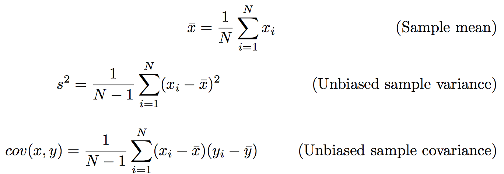

# Computing point stats

## Goals

The goals of this task is to:

* refresh your memory of a few point statistics
* hold data in a list
* iterate over that data
* learn to translate math to Python
* learn to write a few more functions
* create and import a library

The end result is file `stats.py`.

## Description

In mathematics notation, the sample estimates for mean, variance, and covariance are:



We need to convert these to Python.

First, we have to get some data values and represent it as a Python list structure for ith value of x.

```python
def mean(x):
    "sum of values / num elements"
    total = 0.0
    N = len(x)
    for v in x:
        total += v
    return total / N
```

```python
def var(x):
    "sum of diff from mean squared (biased)"
    total = 0.0
    mu = mean(x)  # calls our other function
    N = len(x)
    for v in x:
        total += (v - mu) ** 2
    return total / (N - 1)
```

## Student exercise
